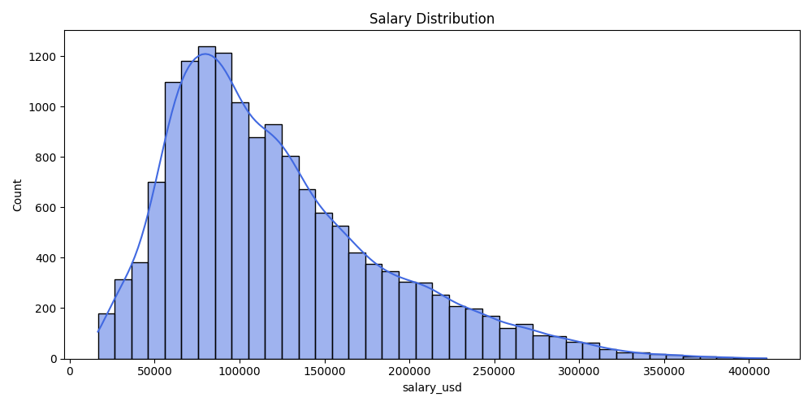
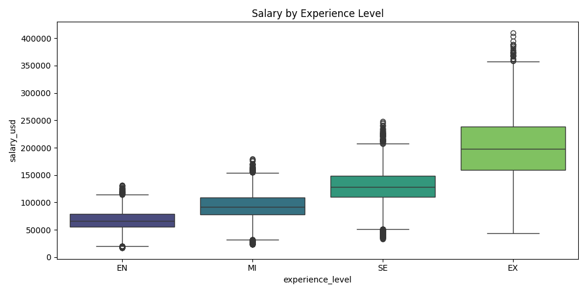
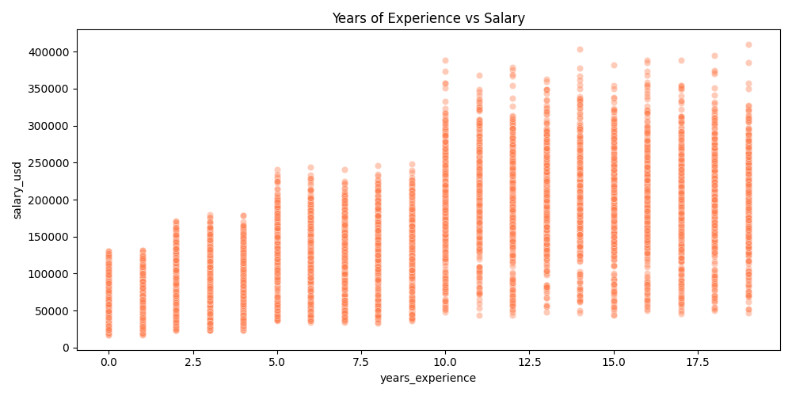
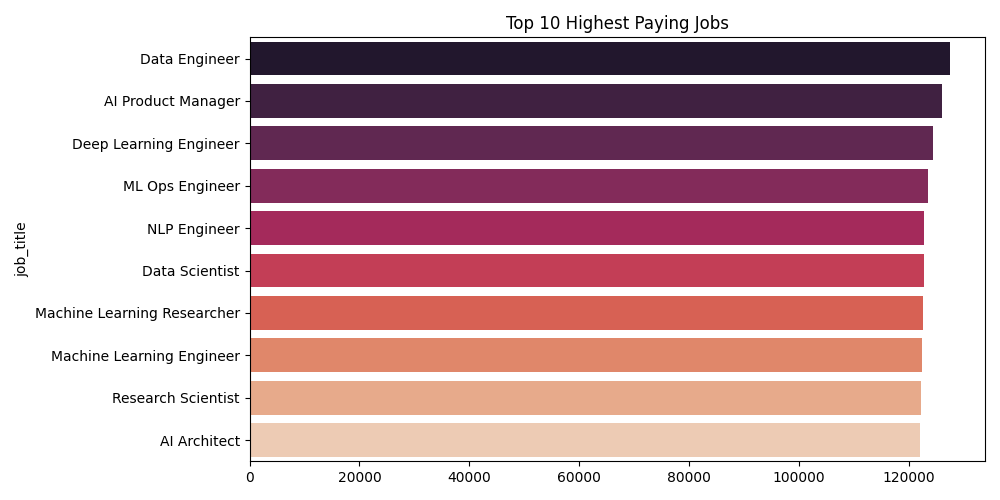
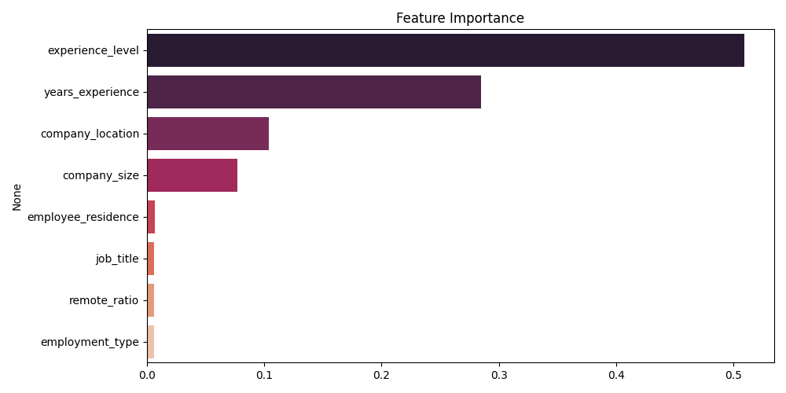

# 💰 Data Science & AI Job Salary Predictor

    

> Predict your Data Science / AI job salary based on job title, experience, years of experience, company size, remote ratio and location — with both **USD and INR** estimates.

## 🌐 Live Demo
👉 **[ds-salary-predictor.streamlit.app](https://ds-salary-predictor.streamlit.app)**

---

## 📌 Problem Statement
Data Science and AI salaries vary massively based on role, experience, location and company size. This project uses Machine Learning to predict expected salary given a professional's profile — helping job seekers benchmark their market value.

---

## 📊 Key Insights from EDA
- 📈 **Years of experience** is the #1 factor affecting salary
- 🌍 **US & Canada based companies** pay significantly higher than other markets
- 🏠 **Remote ratio** has a measurable impact on compensation
- 💼 **ML Engineers & AI Scientists** command the highest salaries
- 🏢 **Large companies** pay more on average than small firms
- 👔 **Executive level** roles earn 3x more than entry level

---

## 🤖 Machine Learning

### Models Trained & Compared:
| Model | R² Score | MAE (USD) |
|-------|----------|-----------|
| Linear Regression | 0.09 | $36,961 |
| Random Forest | 0.53 | $27,778 |
| **XGBoost** ✅ | **0.878** | **$15,782** |

> XGBoost selected as best model — R² improved from 0.55 to 0.878 with better dataset and years_experience feature.

### Features Used:
- Job Title
- Experience Level (EN / MI / SE / EX)
- Years of Experience (0–20)
- Employment Type
- Employee Country
- Remote Ratio
- Company Location
- Company Size

---

## 🌐 Web App Features
- ✅ Clean dropdowns with full labels (no confusing codes!)
- ✅ Years of Experience slider
- ✅ Predicts **USD salary** (Global/US market)
- ✅ Converts to **INR equivalent** automatically
- ✅ Monthly breakdown shown
- ✅ Salary range comment (Entry / Mid / Top-tier)
- ✅ Deployed live on Streamlit Cloud

---

## 🛠️ Tech Stack
| Tool | Purpose |
|------|---------|
| Python | Core language |
| Pandas & NumPy | Data manipulation |
| Matplotlib & Seaborn | Data visualization |
| Scikit-learn | ML pipeline |
| XGBoost | Best performing model |
| Streamlit | Web app deployment |
| Google Colab | Development environment |
| GitHub | Version control |

---

## 📁 Project Structure
```
Data-Science-Salary-Predictor/
├── app.py
├── salary_prediction_model.pkl
├── model_columns.pkl
├── requirements.txt
├── ds_salary_predictor.ipynb
├── chart1_salary_distribution.png
├── chart2_experience_salary.png
├── chart3_years_salary.png
├── chart4_top_jobs.png
├── chart5_feature_importance.png
└── README.md
```

---

## 📈 Visualizations
### Salary Distribution


### Salary by Experience Level


### Years of Experience vs Salary


### Top 10 Highest Paying Jobs


### Feature Importance


---

## 🚀 Run Locally
```bash
git clone https://github.com/Krishnajha15/Data-Science-Salary-Predictor.git
cd Data-Science-Salary-Predictor
pip install -r requirements.txt
streamlit run app.py
```


## 👤 Author
**Krishna Jha**
[](https://www.linkedin.com/in/krishnajha15/)
[](https://github.com/Krishnajha15)
